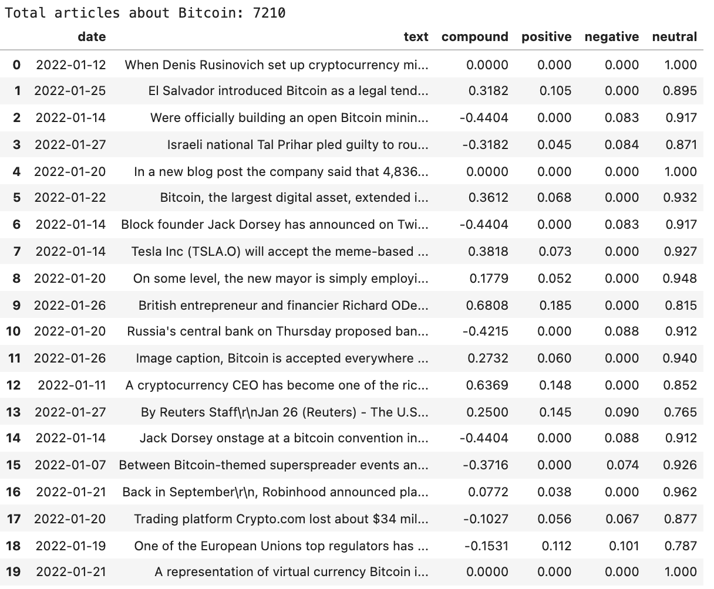
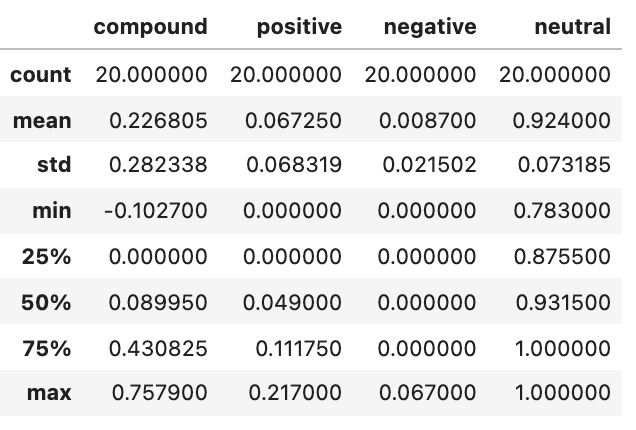

# NLP-Homework

## Table of Contents

1. [Section 1 (Sentiment Analysis](#Section-1)
2. [Section 2 (Natural Language Processing)](#Section-2)
3. [Section 3 (Named Entity Recognition)](#Section-3)

## Section 1

**BTC DataFrame from News API**
---

**ETH DataFrame from News API**
---

**BTC DataFrame Summary Statistics**
---

**ETH DataFrame Summary Statistics**
---

**Question 1**: Which coin had the highest mean positive score?

    - **Answer**: Ethereum had the highest mean positive score of 0.067

**Question 2**: Which coin had the highest compound score?

    - **Answer**: Ethereum had the highest mean compound score of 0.23 and highest max compound score of .76

**Question 3**: Which coin had the highest positive score?

    - **Answer**: Ethereum had the highest max positive score of 0.217

## Section 2

1. **N-Grams**

**BTC Bigram Data**
---

**ETH Bigram Data**
---

2. **Word Clouds**

**BTC Word Cloud**
---

**ETH Word Cloud**
---

## Section 3

**BTC Named Entity Recognition**
---

**ETH Named Entity Recognition**
---
